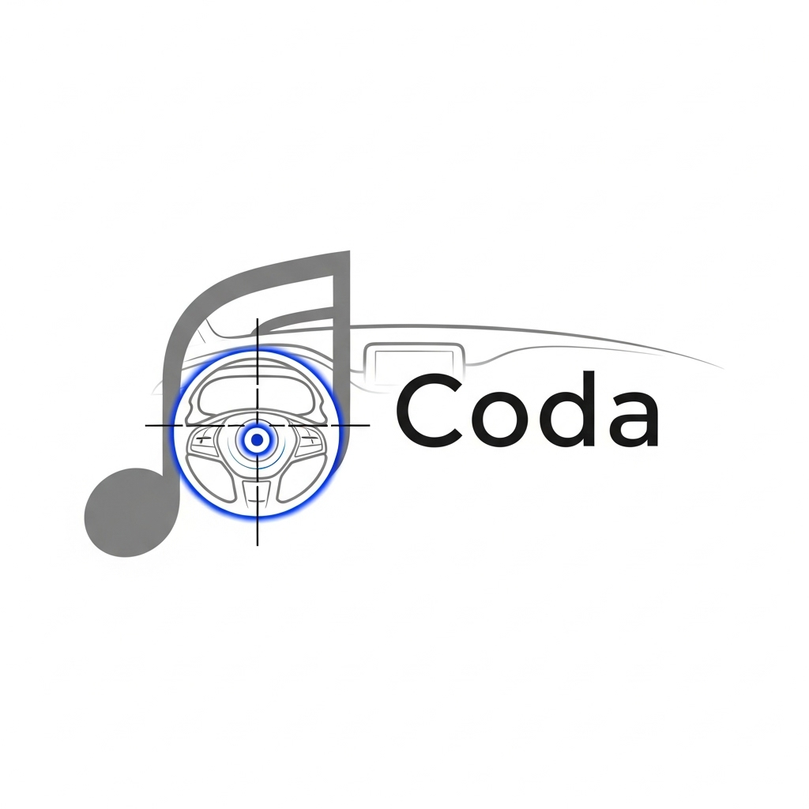

# Greetings, Traveller! Welcome to My Cozy Internet Corner!

## Introduction 

I am Ahmed, nice to meet you!

- I am an ECE graduate from the Faculty of Engineering Alexandria University, Egypt (Class 2024)
- I had finished Information Technology Institute (ITI)'s Professional Training Program Embedded Systems Track. 
- You will find repos in my profile ranging from cheatsheets, all the way to large-scale embedded projects.
- Currently, I work as a Software Engineer @ CairoMotive.

## ITI Graduation Project

## Profile Stats 

